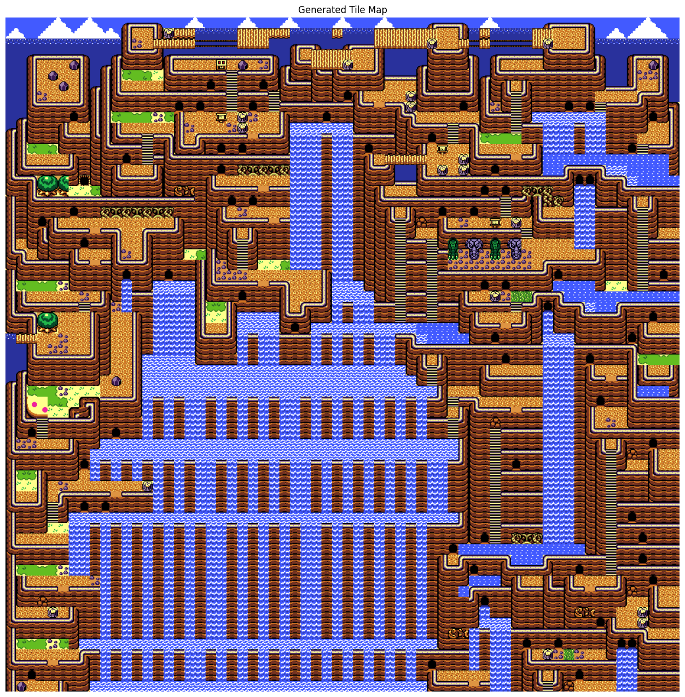

# 2D RNN Neuro Procedural Generation

This repository demonstrates a neural approach to tile‐based neuro procedural content generation (NPCG), using a bidirectional recurrent neural network (RNN) to model and synthesize spatially coherent maps. By framing map layout as a sequence of tile IDs conditioned on a fixed neighbor kernel, the system learns local and semi-global patterns intrinsic to hand‐crafted or artist‐designed maps, then generates new grids with tunable randomness and structural fidelity.

The process is similar to LLM but not for text but rather for tiles.

Side note, while transformer architectures excel at capturing long-range dependencies, they introduce significant complexity and computational overhead with their attention mechanisms and require large datasets to learn positional encodings effectively. RNNs provide a more direct and efficient means to incorporate the immediate context of neighboring tiles and to generate each tile in strict sequence. This strong locality bias aligns naturally with the row-by-row tiling process, reduces both training time and memory usage, and makes the model more robust as the data input is scarce. 

Never the less, A transformer approach could allow more realistic pathway, better city (see datamap ooa_one) and overall a better map layout.

## Technical Overview

Source images in `maps/` are partitioned into 16×16 pixel tiles by `extract_tiles.py`, which deduplicates identical tiles and assigns each a unique integer ID. The layout of any map is thus a grid of these IDs, serialized in a binary (`.dat`) file in `output_tiles/bin/`.

During training, `generator_2d.py` reads all `.dat` files and, for each cell, constructs a sequence of five tokens: four neighbor tiles (north, northeast, east, west) and the target tile. Out‑of‑bounds neighbors are mapped to a special PAD token. Concatenated across all maps, these sequences form the token stream used to train a bidirectional LSTM:

- **Embedding layer** projects tile IDs into a higher dimensional space; a learned positional embedding is added to encode each neighbor’s relative offset.
- A **bidirectional LSTM** processes the sequence, its outputs passed through a linear layer to predict the next tile ID.
- Training optimizes cross‑entropy loss (ignoring PAD).


For generation, the trained model runs in evaluation mode over an N×N grid. Tiles are produced in raster order by repeatedly sampling from the softmaxed logits of the current neighbor context, modified by a temperature parameter (e.g., 0.5), top‑k filtering (k = 100), and a repetition penalty that reduces logits of tiles seen within the last eight positions in the same row or column. The resulting ID grid is visualized by pasting corresponding tile images.

## Example Output

Below are example, map generated with temperature 0.25 and repetition penalty 0.95. Local motifs seamlessly transition across regions, illustrating the model capacity to capture both microstructure and macrostructure.





## Quick Start

Clone the repository, install dependencies, then extract tiles and train/generate in a few commands:

```bash
git clone https://github.com/Cewein/Neuro-Procedural-Generation && cd Neuro-Procedural-Generation
pip install torch numpy pillow matplotlib tqdm
```

You need to also extract the tiles, this is an example using `maps/ooa/` picutre. by default the extraction is 16x16 tiles. it will create a `output_tiles/` directory containing all the possible unique tiles.

```bash
python extract_tiles.py --input_dir maps/ooa/
```

you can then run `generator_2d.py` but you need to modify line 88 the `PAD_TOKEN`. It need to be number of unique + 1 (i.e. look at the last number in the output_tiles folder and add one).

```bash
python generator_2d.py
```

Configuration parameters tile size, neighbor kernel, epochs, generation temperature, top‑k, and repetition penalty—are editable in `generator_2d.py`.

## To do

- [ ] Make the neural network find the symbolic relation ship between tiles (i.e. constraines)
- [ ] make the process herachical (add biome and stuff like that)
- [ ] Fix the failure case of diagonal tiles which currently the network does not support

## References

- Lin, J. (2023). *2D RNN map generation*, blog post on voxely.net
- Graves, A. (2013). *Generating Sequences With Recurrent Neural Networks*. arXiv:1308.0850
- Oord, A. van den, Kalchbrenner, N., & Kavukcuoglu, K. (2016). *Pixel Recurrent Neural Networks*. arXiv:1601.06759
- Summerville, A., Snodgrass, S., Mateas, M., & Rowe, J. (2018). *Procedural Content Generation via Machine Learning (PCGML)*. IEEE Transactions on Games, 10(3–4), 257–270
- Gumin, M. (2016). *WaveFunctionCollapse: Constraint Solving for Real-time Generation*. GitHub repository
- Pathak, D., Krahenbuhl, P., Donahue, J., Darrell, T., & Efros, A. A. (2016). *Context Encoders: Feature Learning by Inpainting*. CVPR 2016
